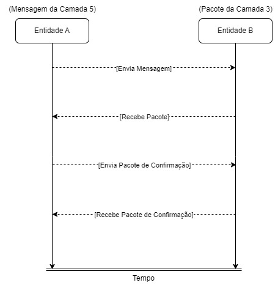
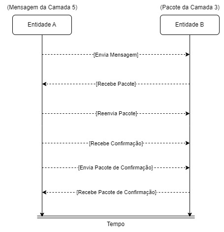
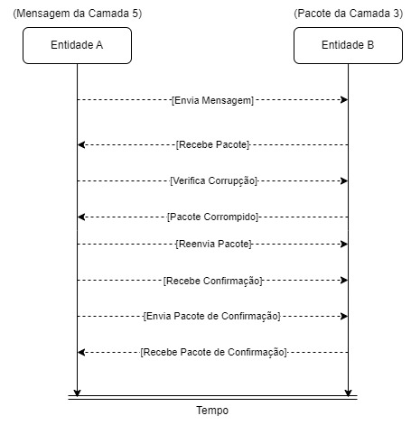
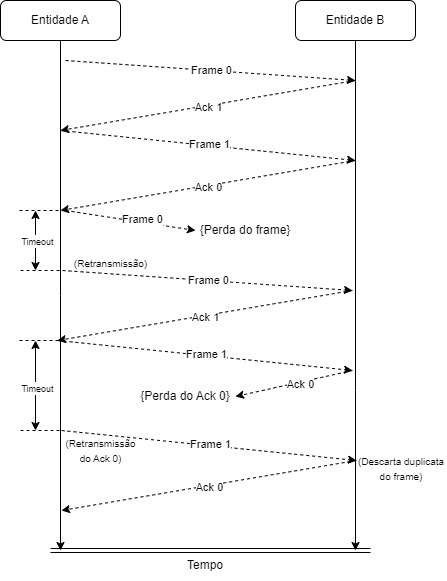
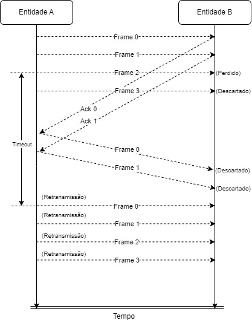

# Análise e implementação dos protocolos de transmissão confiável

Redes de Computadores - 2023/2
Daniel de Sousa da Silva
118064962


## 1. Com base no código `rdtsim_ab.py`

### 1.1. Primeira execução do programa `rdtsim_ab.py`

O programa foi executado com o comando:

```shell
python3 rdtsim_ab.py -n 5 -s 1696178931336185674
```

A saída obtida foi a seguinte:
```text
SIMULATION CONFIGURATION
--------------------------------------
(-n) # layer5 msgs to be provided:      5
(-d) avg layer5 msg interarrival time:  100.0
(-z) transport protocol seqnum limit:   16
(-l) layer3 packet loss prob:           0.0
(-c) layer3 packet corruption prob:     0.0
(-s) simulation random seed:            1696178931336185674
--------------------------------------

SIMULATION SUMMARY
--------------------------------
# layer5 msgs provided to A:      5
# elapsed time units:             509.54794680553255

# layer3 packets sent by A:       5
# layer3 packets sent by B:       4
# layer3 packets lost:            0
# layer3 packets corrupted:       0
# layer5 msgs delivered by A:     0
# layer5 msgs delivered by B:     4
# layer5 msgs by B/elapsed time:  0.007850095413153707
--------------------------------
```

No cenário da simulação executado, os parâmetros de entrada foram configurados da seguinte forma:

- 5 mensagens a serem fornecidas durante a simulação.
- O tempo médio de interchegada de mensagens é de 100.0 unidades de tempo.
- O limite do número de sequência do protocolo de transporte é 16.
- A probabilidade de perda de pacotes da camada 3 é 0.0.
- A probabilidade de corrupção de pacotes da camada 3 é 0.0.
- O seed aleatório da simulação é 1696178931336185674.

Durante a execução da simulação, os seguintes eventos ocorreram:

1. 5 mensagens foram fornecidas à entidade A.
2. A entidade A enviou 5 pacotes para a entidade B.
3. A entidade B enviou 4 pacotes de volta para a entidade A.
4. Nenhum pacote foi perdido durante a transmissão.
5. Nenhum pacote foi corrompido durante a transmissão.
6. A entidade B entregou 4 mensagens à camada 5.

O tempo total transcorrido durante a simulação foi de 509.54794680553255 unidades de tempo. A taxa de mensagens entregues pela entidade B em relação ao tempo transcorrido foi de aproximadamente 0.007850095413153707 mensagens por unidade de tempo.

A dinâmica da troca de mensagens ocorre conforme o seguinte fluxo:

1. A entidade A gera mensagens da camada 5 em intervalos médios de 100 unidades de tempo.
2. A entidade A converte essas mensagens em pacotes da camada 3, que incluem um número de sequência para o controle de fluxo e um checksum para verificar a integridade dos dados.
3. Esses pacotes são transmitidos para a entidade B.
4. A entidade B recebe os pacotes, verifica o número de sequência e a integridade dos dados e responde com pacotes de confirmação.
5. A entidade A, ao receber os pacotes de confirmação, confirma a entrega das mensagens e reinicia o processo.

Durante todo o processo, não houve perda nem corrupção de pacotes, o que resultou em uma entrega bem-sucedida de todas as mensagens pela entidade B.

#### Quantos pacotes foram enviados para B?

O número de pacotes enviados pela entidade A para a entidade B foi 5. Isso significa que a entidade A enviou 5 pacotes para a entidade B durante a simulação.
 
#### Quantos pacotes foram enviados em retorno para A?

O número de pacotes enviados pela entidade B de volta para a entidade A foi 4. Isso indica que a entidade B enviou 4 pacotes em resposta aos pacotes recebidos da entidade A durante a simulação.

#### Qual a diferença entre as mensagens que chegam da camada 5 para A e os pacotes que chegam na camada 3 para B?

Na simulação, existem diferenças entre as mensagens que chegam da camada 5 para a entidade A e os pacotes que chegam na camada 3 para a entidade B:

1. Mensagens da Camada 5 para A:
   - Essas mensagens são dados brutos gerados pela camada de aplicação, prontos para serem transmitidos. Elas são representadas como objetos da classe `Msg` no programa.
   - As mensagens contêm informações que são essenciais para a comunicação entre as entidades A e B. No entanto, elas não incluem informações de controle, como números de sequência ou checksums.

2. Pacotes da Camada 3 para B:
   - Esses pacotes são construídos pela entidade A com base nas mensagens da camada 5. Eles são representados como objetos da classe `Pkt` no programa.
   - Os pacotes da camada 3 incluem informações de controle, como números de sequência e checksums, que são usados para garantir a integridade dos dados durante a transmissão.
   - Além dos dados da mensagem, os pacotes contêm metadados necessários para o funcionamento do protocolo de comunicação, como números de sequência e números de confirmação (acknowledgment numbers).

#### Diagrama de a troca de mensagens

<p align="center">
 
</p>

Neste diagrama, a seta `Envia Mensagem` representa o fluxo de mensagens da camada 5 enviadas pela Entidade A para a Entidade B. A seta `Recebe Pacote` indica o recebimento dos pacotes correspondentes pela Entidade B. Da mesma forma, a seta `Envia Pacote de Confirmação` mostra o envio dos pacotes de confirmação da Entidade B de volta para a Entidade A, seguido pela seta `Recebe Pacote de Confirmação` que representa o recebimento desses pacotes de confirmação pela Entidade A.

### 1.2. Segunda execução do programa `rdtsim_ab.py`

O programa foi executado com o comando:

```shell
python3 rdtsim_ab.py -n 5 -s 1696801869652387816
```

A saída obtida foi a seguinte:
```text
SIMULATION CONFIGURATION
--------------------------------------
(-n) # layer5 msgs to be provided:      5
(-d) avg layer5 msg interarrival time:  100.0
(-z) transport protocol seqnum limit:   16
(-l) layer3 packet loss prob:           0.0
(-c) layer3 packet corruption prob:     0.0
(-s) simulation random seed:            1696801869652387816
--------------------------------------

SIMULATION SUMMARY
--------------------------------
# layer5 msgs provided to A:      5
# elapsed time units:             501.81020793653806

# layer3 packets sent by A:       6
# layer3 packets sent by B:       5
# layer3 packets lost:            0
# layer3 packets corrupted:       0
# layer5 msgs delivered by A:     0
# layer5 msgs delivered by B:     4
# layer5 msgs by B/elapsed time:  0.007971141154039385
--------------------------------
```

Neste cenário específico da simulação, os parâmetros de entrada foram configurados da seguinte forma:

- 5 mensagens a serem fornecidas durante a simulação.
- O tempo médio de interchegada de mensagens é de 100.0 unidades de tempo.
- O limite do número de sequência do protocolo de transporte é 16.
- A probabilidade de perda de pacotes da camada 3 é 0.0.
- A probabilidade de corrupção de pacotes da camada 3 é 0.0.
- O seed aleatório da simulação é 1696801869652387816.

Durante a execução da simulação, os seguintes eventos ocorreram:

1. 5 mensagens foram fornecidas à entidade A.
2. A entidade A enviou 6 pacotes para a entidade B.
3. A entidade B enviou 5 pacotes de volta para a entidade A.
4. Nenhum pacote foi perdido durante a transmissão.
5. Nenhum pacote foi corrompido durante a transmissão.
6. A entidade B entregou 4 mensagens à camada 5.

O tempo total transcorrido durante a simulação foi de 501.81020793653806 unidades de tempo. A taxa de mensagens entregues pela entidade B em relação ao tempo transcorrido foi de aproximadamente 0.007971141154039385 mensagens por unidade de tempo.

Neste cenário específico, observamos um comportamento ligeiramente diferente em comparação com o anterior, com um número ligeiramente maior de pacotes enviados tanto pela Entidade A quanto pela Entidade B. No entanto, não houve perda ou corrupção de pacotes, resultando em uma entrega bem-sucedida das mensagens pela Entidade B.

#### Porque a quantidade de pacotes da camada 3 enviados por A é maior que a quantidade de mensagens enviadas por A?

Neste caso específico, pode haver algumas situações que contribuem para a discrepância observada:

1. Retransmissão de pacotes: Se um pacote não for confirmado como recebido pela Entidade B, a Entidade A pode reenviar esse pacote para garantir a entrega bem-sucedida. Isso resulta no envio de pacotes adicionais.

2. Confirmações de recebimento: A Entidade B pode enviar confirmações de recebimento (acknowledgments) para os pacotes recebidos da Entidade A. Essas confirmações também são enviadas como pacotes separados, o que aumenta o número total de pacotes enviados pela Entidade A.

#### Diagrama de a troca de mensagens

<p align="center">
 
</p>

Neste diagrama, a seta `Envia Mensagem` representa o envio de mensagens da camada 5 pela Entidade A para a Entidade B. A seta `Recebe Pacote` indica o recebimento dos pacotes correspondentes pela Entidade B. A seta `Reenvia Pacote` simboliza a possível retransmissão de pacotes pela Entidade A. A seta `Recebe Confirmação` representa a recepção de confirmações de recebimento pela Entidade A. A seta `Envia Pacote de Confirmação` mostra o envio dos pacotes de confirmação da Entidade B de volta para a Entidade A, seguido pela seta `Recebe Pacote de Confirmação` que representa o recebimento desses pacotes de confirmação pela Entidade A.

Este diagrama demonstra a dinâmica mais detalhada da troca de mensagens entre as entidades A e B, incluindo a possibilidade de retransmissões e confirmações de recebimento que podem ocorrer durante a comunicação.

### 1.3. Terceira execução do programa `rdtsim_ab.py`

O programa foi executado com o comando:

```shell
python3 rdtsim_ab.py -n 5 -s 1696201796773060489 -l 0.1
```

A saída obtida foi a seguinte:

```text
SIMULATION CONFIGURATION
--------------------------------------
(-n) # layer5 msgs to be provided:      5
(-d) avg layer5 msg interarrival time:  100.0
(-z) transport protocol seqnum limit:   16
(-l) layer3 packet loss prob:           0.1
(-c) layer3 packet corruption prob:     0.0
(-s) simulation random seed:            1696201796773060489
--------------------------------------

SIMULATION SUMMARY
--------------------------------
# layer5 msgs provided to A:      5
# elapsed time units:             509.6633116826046

# layer3 packets sent by A:       7
# layer3 packets sent by B:       6
# layer3 packets lost:            2
# layer3 packets corrupted:       0
# layer5 msgs delivered by A:     0
# layer5 msgs delivered by B:     4
# layer5 msgs by B/elapsed time:  0.007848318504218762
--------------------------------
```

Neste cenário específico, o programa foi executado com os seguintes parâmetros:

- 5 mensagens a serem fornecidas durante a simulação.
- O tempo médio de interchegada de mensagens é de 100.0 unidades de tempo.
- O limite do número de sequência do protocolo de transporte é 16.
- A probabilidade de perda de pacotes da camada 3 é 0.1.
- A probabilidade de corrupção de pacotes da camada 3 é 0.0.
- O seed aleatório da simulação é 1696201796773060489.

Durante a simulação, os seguintes eventos foram observados:

1. 5 mensagens foram fornecidas à Entidade A.
2. A Entidade A enviou 7 pacotes para a Entidade B.
3. A Entidade B enviou 6 pacotes de volta para a Entidade A.
4. Dois pacotes foram perdidos durante a transmissão.
5. Nenhum pacote foi corrompido durante a transmissão.
6. A Entidade B entregou 4 mensagens à camada 5.

O tempo total transcorrido durante a simulação foi de 509.6633116826046 unidades de tempo. A taxa de mensagens entregues pela Entidade B em relação ao tempo transcorrido foi de aproximadamente 0.007848318504218762 mensagens por unidade de tempo.

A dinâmica da troca de mensagens nesse cenário segue os mesmos princípios do protocolo de transporte simulado, com a adição da possibilidade de perda de pacotes na camada 3. A perda de pacotes introduz uma incerteza no processo de comunicação, levando a uma maior probabilidade de retransmissões e possivelmente atrasos na entrega de mensagens. Isso pode resultar em um número maior de pacotes sendo enviados para compensar a perda de pacotes, bem como uma possível diminuição na taxa de entrega de mensagens.

#### Diagrama de a troca de mensagens

<p align="center">
 
</p>

### 1.4. Quarta execução do programa `rdtsim_ab.py`

O programa foi executado com o comando:

```shell
python3 rdtsim_ab.py -n 5 -s 2696204675755682844 -c 0.1
```

A saída obtida foi a seguinte:

```text
SIMULATION CONFIGURATION
--------------------------------------
(-n) # layer5 msgs to be provided:      5
(-d) avg layer5 msg interarrival time:  100.0
(-z) transport protocol seqnum limit:   16
(-l) layer3 packet loss prob:           0.0
(-c) layer3 packet corruption prob:     0.1
(-s) simulation random seed:            2696204675755682844
--------------------------------------

SIMULATION SUMMARY
--------------------------------
# layer5 msgs provided to A:      5
# elapsed time units:             454.6066616400901

# layer3 packets sent by A:       7
# layer3 packets sent by B:       6
# layer3 packets lost:            0
# layer3 packets corrupted:       2
# layer5 msgs delivered by A:     0
# layer5 msgs delivered by B:     4
# layer5 msgs by B/elapsed time:  0.00879881519018914
--------------------------------
```

Neste cenário específico, o programa foi executado com os seguintes parâmetros:

- 5 mensagens a serem fornecidas durante a simulação.
- O tempo médio de interchegada de mensagens é de 100.0 unidades de tempo.
- O limite do número de sequência do protocolo de transporte é 16.
- A probabilidade de perda de pacotes da camada 3 é 0.0.
- A probabilidade de corrupção de pacotes da camada 3 é 0.1.
- O seed aleatório da simulação é 2696204675755682844.

Durante a simulação, os seguintes eventos foram observados:

1. 5 mensagens foram fornecidas à Entidade A.
2. A Entidade A enviou 7 pacotes para a Entidade B.
3. A Entidade B enviou 6 pacotes de volta para a Entidade A.
4. Nenhum pacote foi perdido durante a transmissão.
5. Dois pacotes foram corrompidos durante a transmissão.
6. A Entidade B entregou 4 mensagens à camada 5.

O tempo total transcorrido durante a simulação foi de 454.6066616400901 unidades de tempo. A taxa de mensagens entregues pela Entidade B em relação ao tempo transcorrido foi de aproximadamente 0.00879881519018914 mensagens por unidade de tempo.

A dinâmica da troca de mensagens nesse cenário segue os mesmos princípios do protocolo de transporte simulado, com a adição da possibilidade de corrupção de pacotes na camada 3. A corrupção de pacotes introduz incertezas no processo de comunicação, exigindo possíveis retransmissões e verificação adicional de integridade dos dados. Isso pode resultar em um número maior de pacotes sendo enviados para compensar a corrupção de dados, bem como uma possível diminuição na taxa de entrega de mensagens.

#### Qual a diferença entre um pacote corrompido e um pacote perdido?

Um pacote corrompido e um pacote perdido são problemas distintos que podem ocorrer durante a transmissão de dados em um sistema de comunicação.

1. **Pacote Corrompido:** Um pacote corrompido refere-se a um pacote que, devido a interferências, erros ou distorções durante a transmissão, teve seu conteúdo original alterado de alguma forma. A corrupção pode ser o resultado de ruído no canal de comunicação, interferência eletromagnética, problemas de hardware ou software, entre outros fatores. Quando um pacote é corrompido, isso pode levar à perda parcial ou total de dados ou a erros nos dados recebidos. Para lidar com pacotes corrompidos, os sistemas de comunicação geralmente implementam mecanismos de verificação de integridade, como códigos de detecção de erros ou checksums, para identificar e, se possível, corrigir a corrupção.

2. **Pacote Perdido:** Um pacote perdido ocorre quando um pacote enviado de uma entidade de comunicação não é recebido pela entidade de destino. Isso pode ser causado por várias razões, como falhas temporárias ou permanentes no canal de comunicação, congestionamento de rede, erros de roteamento, entre outros fatores. Quando um pacote é perdido, ele não chega ao destino dentro de um tempo razoável, resultando em uma lacuna ou interrupção nos dados transmitidos. Para lidar com pacotes perdidos, os protocolos de comunicação implementam técnicas de retransmissão e controle de fluxo para garantir a entrega confiável de dados.


#### Diagrama de a troca de mensagens

<p align="center">
 
</p>

## 2. Análise sobre as diferenças entre o protocolo de bit alternado e o Go-back-N:

O protocolo de bit alternado e o protocolo Go-Back-N são dois protocolos de controle de erro frequentemente utilizados em comunicações de dados e são usados para garantir a confiabilidade na transferência de dados.

1. **Protocolo de Bit Alternado:**
   - O protocolo de bit alternado é um protocolo de retransmissão simples usado em comunicações ponto a ponto.
   - Ele opera com base em um único bit de confirmação de recebimento (ACK) enviado de volta pelo destinatário.
   - A entidade transmissora envia os pacotes sequencialmente e alterna o bit de sequência para cada pacote.
   - O receptor responde com o ACK correspondente, indicando a recepção bem-sucedida do pacote.
   - Se o transmissor não receber um ACK dentro de um determinado período, ele reenvia o pacote mais recente e aguarda um novo ACK.
   - Não há buffer de retransmissão no protocolo de bit alternado, o que significa que apenas um pacote pode ser retransmitido de cada vez.

2. **Protocolo Go-Back-N:**
   - O protocolo Go-Back-N é um protocolo de controle de erro baseado em janela deslizante, geralmente usado em comunicações de rede.
   - Ele permite que o transmissor mantenha um buffer de retransmissão de vários pacotes.
   - O transmissor pode enviar uma janela de pacotes sem esperar explicitamente por um ACK individual para cada pacote.
   - O receptor confirma a recepção de pacotes cumulativamente, ou seja, confirma uma sequência de pacotes em vez de cada pacote individualmente.
   - Se um pacote for perdido ou corrompido, o receptor rejeita todos os pacotes subsequentes na janela e solicita a retransmissão de todos os pacotes na janela.
   - Isso significa que o transmissor precisa manter cópias de todos os pacotes na janela de envio para possível retransmissão.


### Protocolo de Bit Alternado
<p align="center">
 
</p>


### Protocolo Go-Back-N
<p align="center">
 
</p>

#### Qual dos dois protocolos é mais eficiente em utilização de largura de banda e por quê?

O protocolo Go-Back-N é considerado mais eficiente na utilização da largura de banda,em comparação com o protocolo de bit alternado, devido a sua capacidade de enviar múltiplos pacotes sem interrupções significativas e à sua capacidade de otimizar a retransmissão seletiva.

#### Como cada protocolo lida com pacotes fora de ordem e pacotes duplicados?

### Protocolo de Bit Alternado:

1. **Pacotes fora de ordem:** No protocolo de Bit Alternado, se um pacote é recebido fora de ordem, o receptor descarta o pacote fora de ordem e não envia nenhuma confirmação (ACK) ao transmissor. Em vez disso, ele espera o pacote correto chegar antes de enviar a confirmação.

2. **Pacotes duplicados:** Se um pacote duplicado for recebido, o receptor envia uma confirmação ACK duplicada para o transmissor. O transmissor reconhece isso como um sinal de que o último pacote foi recebido corretamente, e reenvia o próximo pacote na sequência.

### Protocolo Go-Back-N:

1. **Pacotes fora de ordem:** No protocolo Go-Back-N, se um pacote é recebido fora de ordem, o receptor descarta o pacote fora de ordem e não envia nenhuma confirmação (ACK) ao transmissor. No entanto, isso resulta em uma retransmissão posterior de todos os pacotes na janela, mesmo aqueles que foram recebidos corretamente.

2. **Pacotes duplicados:** Quando um pacote duplicado é recebido, o receptor envia uma confirmação ACK repetida ao transmissor. Como resultado, o transmissor assume que o pacote foi recebido corretamente e, portanto, não reenvia o pacote.

#### Tamanho da Janela/Buffer de Recepção

### Protocolo de Bit Alternado:

- No protocolo de Bit Alternado, o tamanho da janela ou do buffer de recepção é efetivamente 1, já que apenas um único pacote pode ser transmitido de cada vez. Isso implica que, mesmo que o buffer de recepção seja maior, o desempenho não será melhorado, pois o protocolo opera em um modo de transmissão e confirmação sequencial.

### Protocolo Go-Back-N:

- O desempenho do protocolo Go-Back-N é diretamente afetado pelo tamanho da janela deslizante ou do buffer de recepção. Uma janela maior permite que mais pacotes sejam transmitidos antes de qualquer confirmação de recebimento, o que resulta em uma melhor utilização da largura de banda e uma redução no tempo de espera por parte do transmissor. No entanto, um tamanho de janela muito grande pode levar a um aumento no uso de memória e a um potencial aumento na probabilidade de erros de transmissão, especialmente em redes com alta taxa de perda de pacotes.
